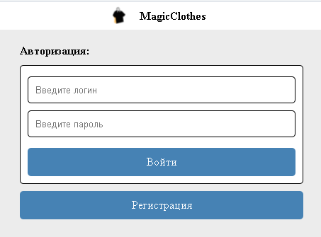

# Magic Clothes
Данный проект является простейшим интернет-магазином  
При заходе на страницу, у нас появиться окно авторизации  

У нас есть два варианта событий:
1. **Авторизация** *(если у вас уже есть аккаунт)*
2. **Регистрация** *(если аккаунта нет)*

Так как у пользователя ещё нет страницы, то ему придётся регистрироваться  
Тут у нас есть вариант указать, какой тип аккаунта мы можем зарегистрировать:
1. **Покупатель**
    > Мы сможем только смотреть товары, аккаунты продавцов, покупать товары и менять свои данные
2. **Продавец**
    > Мы сможем смотреть заказы, добавлять товары, удалять или продавать их, а также изменять свои данные
