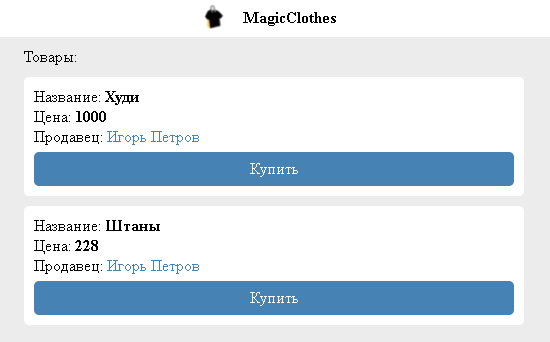
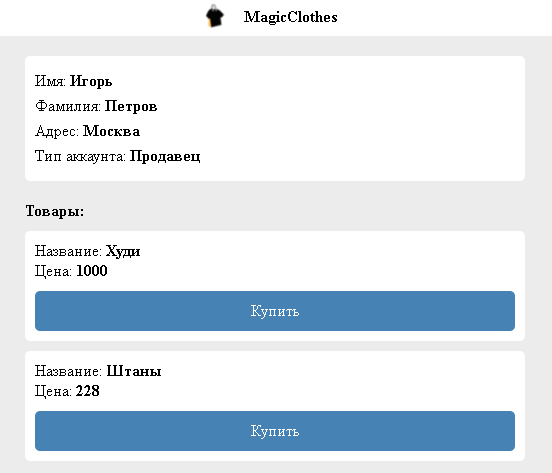
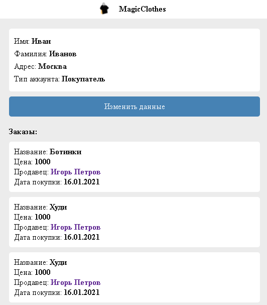
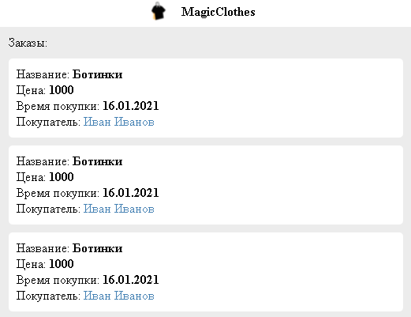
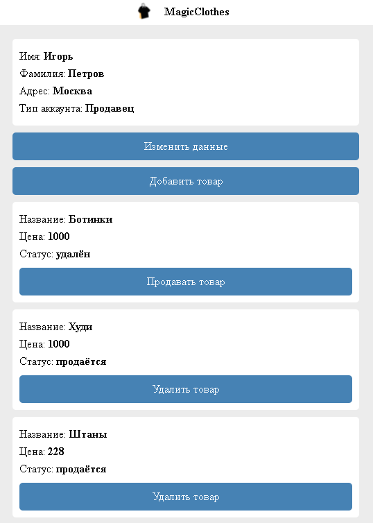

# Magic Clothes
Данный проект является простейшим интернет-магазином  

## Установка
Для установки нам надо:
* установить файлы в директорию
* загрузить базу данных
    > Она называется *internet_shop.sql*
* изменить в *PHP* файлах данные для соединения к *MySQL*

## Начало

При заходе на страницу, у нас появиться окно авторизации  

У нас есть два варианта событий:
1. **Авторизация** *(если у вас уже есть аккаунт)*
2. **Регистрация** *(если аккаунта нет)*

Так как у пользователя ещё нет страницы, то ему придётся регистрироваться  
Тут у нас есть вариант указать, какой тип аккаунта мы можем зарегистрировать:
1. **Покупатель**
    > Мы сможем только смотреть товары, аккаунты продавцов, покупать товары и менять свои данные
2. **Продавец**
    > Мы сможем смотреть заказы, добавлять товары, удалять или продавать их, а также изменять свои данные

## Аккаунт пользователя
При авторизации на аккаунте пользователя, мы увидим доступные товары  
В блоке товары отображается название товара, её цена и продавец
> При нажатии на имя продавца, нас закинет на его аккаунт

### Страница продавца
На странице продавца мы можем увидеть его имя, фамилию, адрес, тип аккаунта, а также товары, которые он продаёт

### Наш профиль
Для того чтобы перейти в наш профиль, нужно в шапке сайта нажать на логотип с текстом  
В нашем профиле мы также увидим наши данные, кнопку для изменения данных и наши заказы

## Аккаунт продавца
На стартовой странице мы можем увидеть наши заказы  
В каждом блоке заказа отображено название товара, цена, время покупки, а также имя покупателя, нажав на которое, мы можем перейти в его профиль 

### Наш профиль
Для того, чтобы перейти в наш профиль, нам также надо нажать на логотип с текстом в шапке  
Здесь мы можем изменить наши данные, добавить товар, а также удалить или добавить товары в продажу

